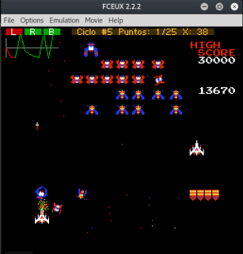
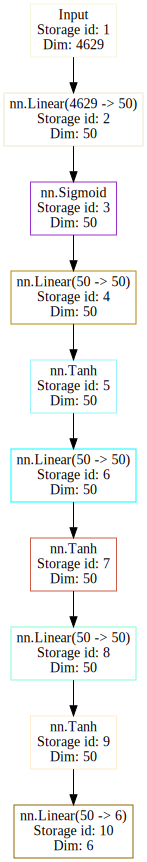

# Gautolaga



Gautolaga es una interfaz Lua para el emulador de NES FCEUX que implementa una red neuronal y la entrena en base a las posiciones en pantalla de los personajes y de las consecuencias de las acciones anteriores. 

Por Rilke Petrosky <xenomuta@gmail.com>

## Red neuronal

Gautolaga implementa una sencilla red neuronal secuencial, con varias capas lineares.

### Parametros

- Capa de entrada de 3,856 neuronas:
	- 3,840 => 4 ultimas pantallas: de 960 bytes, 32x30 posiciones de cuadros
	- 4		=> 4 ultimas posiciones X
	- 12	=> 4 ultimos comandos de 3 botones (izquierda, derecha y fuego)
- Capa profunda, 1,000 neuronas:
	- 5 capas 200 -> Tanh()
- Capa de salida de 3 neuronas:
	- Una para cada boton: (izquierda, derecha y fuego)

### Diagrama



## Ejecutar

Cargar el ROM de Galaga y luego cargar [gautolaga.lua](./gautolaga.lua)
o ejecutar `./run.sh` desde la consola.

## Dependencias

- [FCEUX](http://fceux.com): Emulador de Nintendo Entertainment System
- ROM de Galaga para NES.
- [torch7](https://github.com/torch/torch7): Framework de computación científica para LuaJIT
- [torch/nn](https://github.com/torch/nn): Librería de redes neuronales para Torch

## Notas

- Gautolaga constantemente se entrena en base a la experiencia:
	- Premia el matar ( insectos espaciales ) y la supervivencia.
	- Castiga la pereza ( no moverse ) y la muerte.
	- Sus parámetros de experiencia estan en [experiencia.lua](./experiencia.lua)

		```lua
		-- Parametros de experiencia (Premios y Castigos)
		PEREZA = -.5
		MUERTE = -2.5
		MATAR  = 1.75
		-- MUERTE = -10 --[[ COBARDE ]]
		-- MATAR  = 10 --[[ Asesino ]]
		```
	- Desbalancear estos valores puede generar loops infinitos en el entrenamiento (desaparición o explosión del desenso de la degriente).

- Cada estado se almacena en archivos de ~15 MB (`mente-c-{ciclos}-p-{puntos}.dat`)
- Se hace un link simbólico al último (`mente.dat`)

## Bugs

- Aveces restaura un estado de muerte inevitable resultando en degradar los pesos de la capa oculta.
- No detecta las pantalla de demo, game over y menu principal, resultando en falso entrenamiento impredecible.

## Mejoras e Ideas para algún día

- Agregar redes neuronales recurrentes LSTM para nocion temporal
- Agregar control completo y desambiguar de __galaga__ para emplearse en cualquier ROM
- Mejor entrenamiento (optimizadores, momentum, ratio de aprendizaje ajustable)
